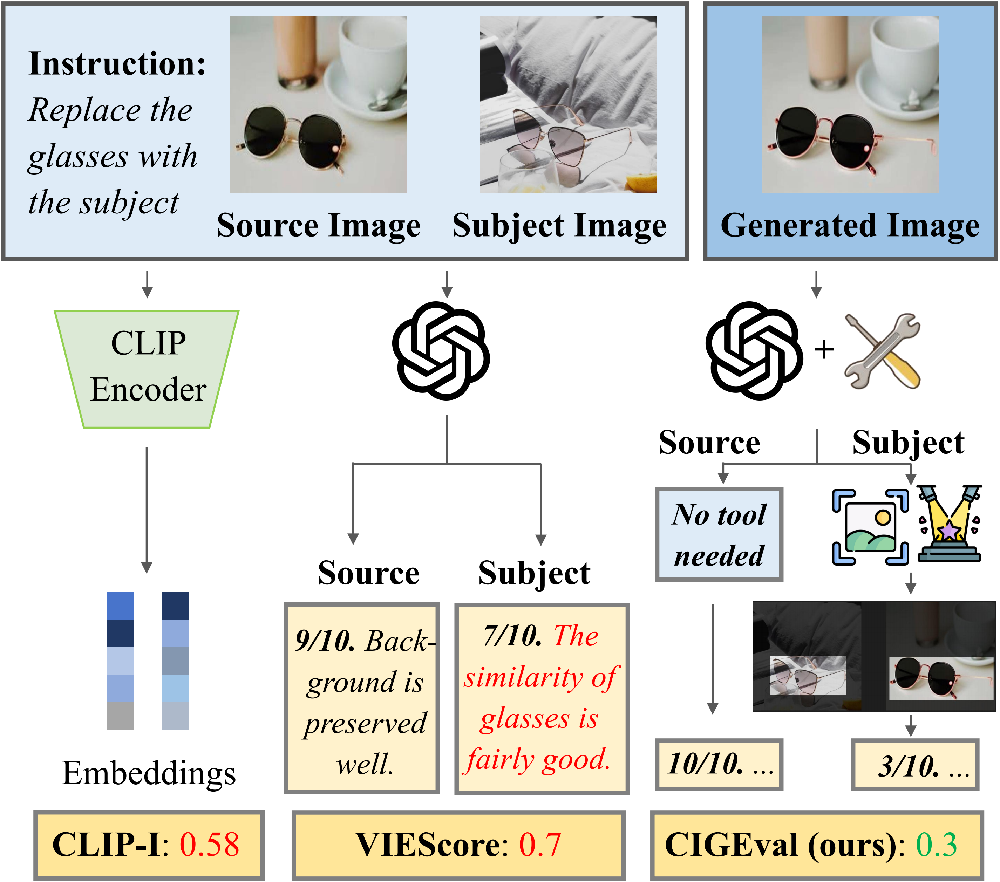

# CIGEval
<p align="center">
   📃 <a href="" target="_blank">Paper</a>
</p>
In this work, we propose CIGEval, a unified agentic framework for comprehensive evaluation of conditional image generation tasks. CIGEval utilizes large multimodal models (LMMs) as its core, integrating a multi-functional toolbox to enable fine-grained evaluation.
Please check out our paper <a href="" target="_blank">"A Unified Agentic Framework for Evaluating Conditional Image
Generation"</a>.
<p align="center">
</img>
</p>

## Framework
CIGEval adopts a divide-and-conquer scheme for evaluating images generated under multiple conditions. For each sub-question, CIGEval selects the most suitable tool from its toolbox, focusing on the specific aspect of evaluation. Then, the LMM analyzes the tool outputs and assigns scores.
<p align="center">
</img>
</p>


## Installation
Please follow [install](INSTALL.md) page to set up the environments and models.

## Text-to-Image Synthesis Evaluation
Get score with rationale for evaluating the alignment between image and text prompt.
```
python llm_score.py --image sample/sample.png --text_prompt "a red car and a white sheep"
```

Try different LLMs by setting LLM_ID as one of ["gpt-4", "gpt-3.5-turbo", "vicuna"]:
```
python llm_score.py --image sample/sample.png --text_prompt "a red car and a white sheep" --llm_id LLM_ID
```

Notice that to use Vicuna, follow Part **Install** and Part **Model Weights** in [FastChat_README](https://github.com/lm-sys/FastChat) to install fastchat and to obtain the Vicuna weights.
To enable OpenAI-compastible APIs used in our repo, follow commands from [Guideline](https://github.com/lm-sys/FastChat/blob/main/docs/openai_api.md) to launch the controller, model worker and RESTful API server as below:
```
python3 -m fastchat.serve.controller
python3 -m fastchat.serve.model_worker --model-name 'vicuna-7b-v1.1' --model-path /path/to/vicuna/weights
python3 -m fastchat.serve.openai_api_server --host localhost --port 8000
```

## LLMScore with Rationale

<p align="center">
</img>
</p>

## Human Correlation

The rank correlation (Kendall's tau) is aggregated across the compositional prompt dataset (Concept Conjunction, Attribute Binding Contrast) on the left two columns (CompBench) and the general prompt dataset (MSCOCO, DrawBench, PaintSkills) on the right two columns (GeneralBench).
<p align="center">
</img>
</p>


## 📚Citation

If you found this repository useful, please consider cite our paper:

```bibtex
@misc{lu2023llmscore,
      title={LLMScore: Unveiling the Power of Large Language Models in Text-to-Image Synthesis Evaluation}, 
      author={Yujie Lu and Xianjun Yang and Xiujun Li and Xin Eric Wang and William Yang Wang},
      year={2023},
      eprint={2305.11116},
      archivePrefix={arXiv},
      primaryClass={cs.CV}
}
```
