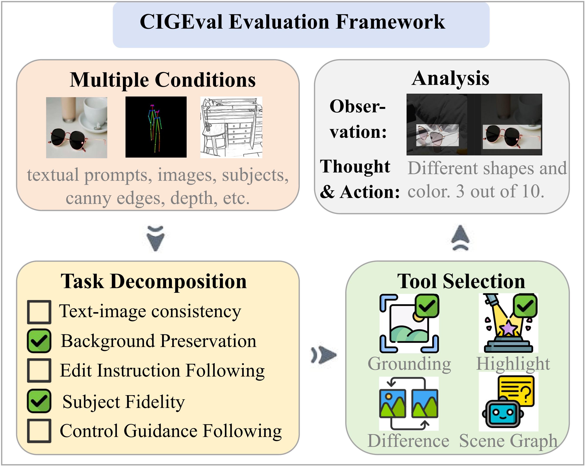

# CIGEval
<p align="center">
   📃 <a href="https://arxiv.org/abs/2504.07046" target="_blank">Paper</a>
</p>
In this work, we propose CIGEval, a unified agentic framework for comprehensive evaluation of conditional image generation tasks. CIGEval utilizes large multimodal models (LMMs) as its core, integrating a multi-functional toolbox to enable fine-grained evaluation. Please check out our paper <a href="https://arxiv.org/abs/2504.07046" target="_blank">"A Unified Agentic Framework for Evaluating Conditional Image Generation"</a>.


## 🌟 Framework
CIGEval adopts a divide-and-conquer scheme for evaluating images generated under multiple conditions. For each sub-question, CIGEval selects the most suitable tool from its toolbox, focusing on the specific aspect of evaluation. Then, the LMM analyzes the tool outputs and assigns scores.
<p align="center">
</img>
</img>
</p>


## ⚡️ Installation
Run the following command to set up the environments.
```
conda env create -f environment.yml
```
The toolbox contains grounding tool. Please refer to [GroundingDINO](https://github.com/IDEA-Research/GroundingDINO) to configure the environment and model. In addition, you need to download the evaluation images and human ratings from [ImagenHub](https://tiger-ai-lab.github.io/ImagenHub/)


## ✨ Conditional Image Synthesis Evaluation
Run the following command to use CIGEval to evaluate 7 conditional image synthesis tasks:
```
python evaluate.py
```
We also provide the [VIEScore](https://github.com/TIGER-AI-Lab/VIEScore) evaluation method:
```
python evaluate_vie.py 
```
Then you can use `spear.py` to calculate the correlation between the evaluation results and human ratings.

## 📌 SFT
To empower smaller LMMs as effective evaluators, we aim to perform supervised fine-tuning on 7B models to integrate agentic capabilities into them. We employ GPT-4o to carry out the evaluation process of CIGEval in order to curate high-quality trajectory data. Using 60% of the ImagenHub data, we ultimately gather 2,274 high-quality trajectories for supervised fine-tuning. Using this structured trajectory data, we perform supervised fine-tuning on Qwen2-VL-7B-Instruct and Qwen2.5-VL-7B-Instruct. You can visit [trajectories](https://huggingface.co/datasets/HIT-TMG/CIGEval_sft_data) to get the sft data, and visit [Qwen2-VL-7B-Instruct-sft]() and [Qwen2.5-VL-7B-Instruct-sft]() to get our fine-tuned models.

## ⚖️ Paper Results
<p align="center">
</img>
</p>
<p align="center">
</img>
</p>


## 📚 Citation

If you found this repository useful, please consider cite our paper:

```bibtex
@misc{wang2025cigeval,
      title={A Unified Agentic Framework for Evaluating Conditional Image Generation}, 
      author={Jifang Wang and Xue Yang and Longyue Wang and Zhenran Xu and Yiyu Wang and Yaowei Wang and Weihua Luo and Kaifu Zhang and Baotian Hu and Min Zhang},
      year={2025},
      eprint={2504.07046},
      archivePrefix={arXiv},
      primaryClass={cs.CV},
      url={https://arxiv.org/abs/2504.07046}, 
}
```
